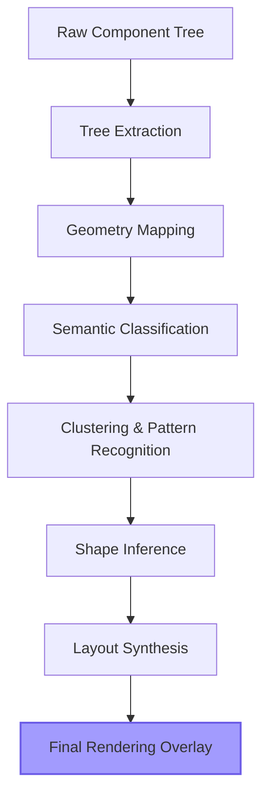

<div align="center">
  

  <h1>⚡ Skelon</h1>
  <p><strong>The Intelligent Layout Inference Engine for Seamless Skeleton Loading</strong></p>
  
  <p>
    <a href="https://www.npmjs.com/package/@skelon/core"></a>
    <a href="https://github.com/ingointo/skelon/actions/workflows/ci.yml"></a>
    <a href="https://www.npmjs.com/package/@skelon/core"></a>
    
    
  </p>

  <p>
    <i>Automatically transform any UI layout into its skeleton counterpart with zero manual effort.</i>
  </p>
</div>

---

## 🔥 The Problem

Writing skeleton screens is a **maintenance nightmare**. For every UI component you build, you usually have to write a corresponding "Skeleton" component, manually matching widths, heights, margins, and padding. 

**When your real UI changes, your skeletons break.**

## ✨ The Solution: Skelon

Skelon is a next-generation layout inference engine. Instead of you writing skeletons, Skelon **analyzes your actual rendered components** and synthesizes a pixel-perfect placeholder hierarchy in real-time.

> [!TIP]
> **Stop writing `<Skeleton width={200} />`.** Simply wrap your content in `<Skelon>` and focus on your features.

---

## 🌟 Key Features

### 🤖 Intelligent Inference
Skelon doesn't just "guess." It uses a **10-stage geometry pipeline** to detect semantic roles:
- **Avatars**: Detects circular containers with high border-radius.
- **Text Blocks**: Analyzes font-size and line-height to render matching line counts.
- **Buttons**: Identifies interactive elements and matches their rounded corners exactly.
- **Card Layouts**: Clusters related elements to maintain structural integrity.

### ⚡ Performance First
- **60 FPS Rendering**: Uses memoized layout extraction and hardware-accelerated CSS animations.
- **Zero Layout Shift**: By measuring the real DOM/Native nodes, Skelon ensures the "ghost" layout occupies the exact same space.

### 📦 Ecosystem Ready
Skelon is modular and framework-agnostic at its core.
- **React**: Full support for React 18+ and Next.js.
- **React Native**: Native views and high-performance animation loops.
- **CLI**: Batch processing for static preset generation.

---

## 📦 Installation

```bash
# Using pnpm (Recommended)
pnpm add @skelon/core @skelon/react

# Using npm
npm install @skelon/core @skelon/react

# Using yarn
yarn add @skelon/core @skelon/react
```

---

## 🚀 Quick Start

### Basic Usage
The simplest way to use Skelon is to wrap your component and toggle the `loading` prop.

```tsx
import { Skelon } from '@skelon/react';

const UserProfile = ({ user, isLoading }) => {
  return (
    <Skelon loading={isLoading}>
      <div className="card">
        
        <h2>{user.name}</h2>
        <p>{user.description}</p>
        <button>View Profile</button>
      </div>
    </Skelon>
  );
};
```

### Advanced Usage: Manual Overrides
While Skelon is "zero-config," you can easily override detected types for specific elements using data attributes.

```html
<div data-skelon-type="avatar">...</div> <!-- Force avatar rendering -->
<div data-skelon-type="image">...</div>  <!-- Force image block -->
```

---

## 🧠 Deep Dive: The Core Engine

Skelon operates using a sophisticated transformation pipeline:



### 1. Geometry Mapping
Unlike naive skeleton libraries, we don't just copy classes. We measure every node's **ClientBoundingRect** relative to the `Skelon` root container, ensuring that even complex Flexbox and Grid layouts are preserved perfectly.

### 2. Semantic Heuristics
Our classification engine uses structural cues:
- If `borderRadius >= width / 2` ➡️ **Avatar**
- If `display: block` and contains text ➡️ **TextLines**
- If `element` is `button` or `input` ➡️ **ButtonShape**

---

## ⚡ Skelon CLI Toolkit

For enterprise applications, use `@skelon/cli` to generate static presets. This removes the runtime overhead of DOM measurement for static pages.

```bash
# Scan components for structural patterns
npx skelon scan --dir ./src/components

# Generate preset files
npx skelon generate --output ./src/skelon-presets.ts
```

---

## ❤️ Support

If you find Skelon useful and it has saved you hours of manual CSS work:

- ⭐ **Star the repository** to show your support.
- 🐛 **Report issues** if you find bugs or edge cases.
- 🚀 **Contribute improvements** by opening a Pull Request.

Together we can make Skelon the absolute standard for skeleton engine loading in the JavaScript ecosystem.

---

## 🤝 Contributing

We are actively seeking maintainers for Svelte, Vue, and SolidJS adapters. Check our [Contributing Guide](CONTRIBUTING.md) to get started!

1. `git clone https://github.com/ingointo/skelon.git`
2. `pnpm install`
3. `pnpm test`

---

## 📄 License

MIT License

Copyright © 2026

Created by [ingointo](https://github.com/ingointo)

Built for the open-source community.
