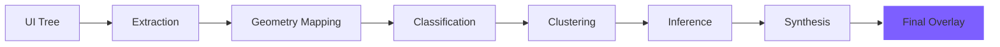

<div align="center">
  

  <h1>⚡ Skelon</h1>
  <p><strong>The Intelligent Skeleton Loading Engine for Modern JavaScript</strong></p>
  
  <p>
    <a href="https://www.npmjs.com/package/@skelon/core"></a>
    <a href="https://github.com/ingointo/skelon/actions/workflows/ci.yml"></a>
    <a href="https://www.npmjs.com/package/@skelon/core"></a>
    
  </p>
</div>

---

### Why settle for manual skeletons? 🕵️‍♂️
Skelon is a next-generation skeleton loading engine that **automatically generates pixel-perfect loading placeholders by analyzing your real UI layout structures**. 

Stop wasting hours manually writing, maintaining, and duplicating placeholder components like `<Skeleton width={100} height={20} />`. Just wrap your components in `<Skelon>`, and let the engine intelligently infer your layout.

## 🌟 Key Features

* 🤖 **Intelligent Inference**: Automatically detects avatars, buttons, text blocks, and card layouts using structural heuristics.
* ⚡️ **High Performance**: Advanced layout clustering and memoization ensure 60fps performance even on massive trees.
* 📦 **Framework Agnostic Core**: Built to run anywhere. Supports React (Web), React Native, and Expo out of the box.
* 🎨 **Premium Shimmer**: GPU-accelerated, glassmorphism-inspired shimmer animations.
* 🛠 **CLI Toolkit**: statically generate layout presets for enterprise-scale performance with `@skelon/cli`.

---

## 📦 Installation

Skelon is modular. Install the core engine and the adapter for your preferred framework:

| Package | Purpose | Install Command |
| :--- | :--- | :--- |
| **@skelon/core** | The Brain (Required) | `pnpm add @skelon/core` |
| **@skelon/react** | Web / Next.js Adapter | `pnpm add @skelon/react` |
| **@skelon/react-native** | RN / Expo Adapter | `pnpm add @skelon/react-native` |
| **@skelon/cli** | Static Generation Tool | `pnpm add -D @skelon/cli` |

---

## 🚀 Quick Start (React)

Wrap your existing layout with `<Skelon>` and pass your `loading` state. While `loading` is true, Skelon measures the underlying nodes and overlays a matching skeleton hierarchy.

```tsx
import { Skelon } from '@skelon/react';

export function ProfileCard({ user, isLoading }) {
  return (
    <Skelon loading={isLoading}>
      <div className="profile-container">
        {/* Detected as 'avatar' -> Perfect circle skeleton */}
        
        
        <div className="info">
          {/* Detected as 'text-lines' -> Multi-line text skeletons */}
          <h3>{user?.name}</h3>
          <p>{user?.bio}</p>
        </div>
        
        {/* Detected as 'button' -> Rounded rect skeleton */}
        <button>Follow</button>
      </div>
    </Skelon>
  );
}
```

---

## 🧠 The 10-Stage Pipeline

Skelon isn't just a UI component; it's a structural analysis engine.



1. **Extraction:** Recursively traverses the DOM/Component tree.
2. **Geometry:** Measures exact positions relative to parents to prevent layout drift.
3. **Classification:** Heuristics detect semantic roles (e.g., `border-radius >= 50%` = Avatar).
4. **Inference:** Calculates how many lines of text should be rendered based on container height.
5. **Synthesis:** Generates a lightweight parallel tree for the shimmer overlay.

---

## ⚡ Skelon CLI

Bypass runtime measurements in production by pre-generating static presets.

```bash
# Scan your project components
npx skelon scan --dir ./src/components

# Generate a static preset file
npx skelon generate --out ./src/skelon-presets.ts
```

---

## 🤝 Contributing

We are building the future of loading states. Contributions are welcome for Vue, Svelte, and SolidJS adapters!

1. Clone: `git clone https://github.com/ingointo/skelon.git`
2. Install: `pnpm install`
3. Build: `pnpm build`
4. Test: `pnpm test`

---

## 📄 License

MIT © 2026 [ingointo](https://github.com/ingointo). Made for the community.
