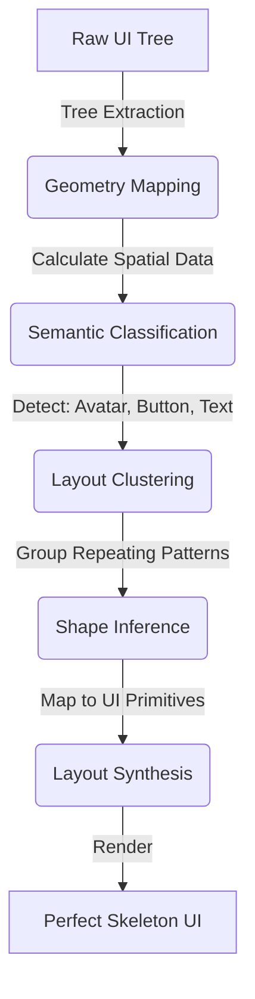

<div align="center">
  <h1>⚡ Skelon</h1>
  <p><strong>The Intelligent Skeleton Loading Engine for Modern JavaScript</strong></p>
  
  <p>
    <a href="https://www.npmjs.com/package/@skelon/core"></a>
    <a href="https://github.com/yourusername/skelon/blob/main/LICENSE"></a>
    <a href="https://www.npmjs.com/package/@skelon/core"></a>
    
  </p>
</div>

---

Skelon is a next-generation skeleton loading engine that **automatically generates pixel-perfect loading placeholders by analyzing your real UI layout structures**. 

Stop wasting hours manually writing, maintaining, and duplicating placeholder components (e.g., `<Skeleton width={100} height={20} />`). Just wrap your components in `<Skelon>`, and let the engine intelligently infer your layout.

## 🌟 Why Skelon?

* 🤖 **Zero Configuration**: Automatically detects avatars, buttons, text blocks, and card layouts.
* ⚡️ **Blazing Fast**: Advanced layout clustering and memoization ensure 60fps performance even on massive trees.
* 📦 **Framework Agnostic Core**: Built to run anywhere. Supports React (Web), React Native, Expo out of the box.
* 🎨 **Beautiful Defaults**: Smooth, GPU-accelerated shimmer animations that adapt to your container constraints.
* 🛠 **CLI Powered**: Pre-generate layout templates statically for massive enterprise apps using `@skelon/cli`.

---

## 📦 Installation

Skelon is highly modular. Install the core engine and the adapter for your framework:

### For React & Next.js (Web)
```bash
npm install @skelon/core @skelon/react
# or yarn add / pnpm add
```

### For React Native & Expo
```bash
npm install @skelon/core @skelon/react-native
```

---

## 🚀 Quick Start

Wrap your existing layout with `<Skelon>` and pass your `loading` state. While loading is true, Skelon measures the underlying nodes and seamlessly overlays a perfectly matching skeleton hierarchy.

### React / Web Example

```tsx
import React from 'react';
import { Skelon } from '@skelon/react';

export function UserProfile({ user, isLoading }) {
  return (
    <Skelon loading={isLoading}>
      <div className="flex items-center space-x-4 p-4 border rounded-xl">
        {/* Intelligently detected as 'avatar' -> renders a perfect circle skeleton */}
        
        
        <div>
          {/* Intelligently detected as 'text-lines' -> renders multi-line text skeletons */}
          <h2 className="text-xl font-bold">{user?.name || "Placeholder Name"}</h2>
          <p className="text-gray-500">{user?.role || "Software Engineer at Acme Corp"}</p>
        </div>
        
        {/* Intelligently detected as 'button' -> renders a rounded rect skeleton */}
        <button className="px-4 py-2 bg-blue-500 text-white rounded-lg">
          Follow
        </button>
      </div>
    </Skelon>
  );
}
```

---

## 🧠 How the Intelligent Engine Works

Skelon isn't just a UI component; it's a structural analysis engine. Here is what happens under the hood when you pass `loading={true}`:



1. **Extraction & Geometry:** Measures exact dimensions, padding, rounded corners, and flexbox configurations.
2. **Classification heuristics:** For instance, an element with `border-radius >= width / 2` is classified as an `avatar`. A text node with no children calculates its string length to estimate `text-lines`.
3. **Synthesis & Shimmer:** A lightweight, parallel Skeleton Tree is created and animated using CSS background gradients or React Native `Animated` loops.

---

## ⚡ Skelon CLI Toolkit

For enterprise monorepos, running layout analysis at runtime might be overkill. Enter the Skelon CLI.

Scan your codebase to detect repeating layout patterns (e.g., identical List Items) and statically generate reusable Skeleton Preset files.

```bash
# Scan your project for structural UI habits
npx @skelon/cli scan --dir ./src/components

# Generate a static preset file
npx @skelon/cli generate --out ./src/skelon-presets.ts
```

Then, feed the presets into your provider to bypass runtime DOM measurement entirely!

---

## 🤝 Contributing

We want Skelon to be the standard across the entire JavaScript ecosystem. We are actively looking for contributors to help build adapters for:
- [ ] Vue / Nuxt
- [ ] Svelte / SvelteKit
- [ ] SolidJS

### Local Development Setup

Skelon is a monorepo powered by `pnpm` and `turborepo` (via `tsup`).

```bash
git clone https://github.com/yourusername/skelon.git
cd skelon
pnpm install
pnpm build
```

---

## 📄 License

MIT Copyright (c) 2026. Made with ❤️ for the open-source community.
